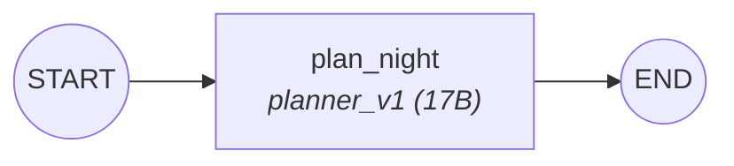

# Module 1 — Single Agent + Observability


## The Graph



One node. One LLM call. That's it — and it's already an agent.

## State Shape

```python
# graph/m1/state.py
class M1State(TypedDict):
    request: NightOutRequest      # input: city, vibe, date, group_size
    messages: Annotated[list, add_messages]
    itinerary: Itinerary | None   # output: structured night plan
```

Three fields. The request goes in, the itinerary comes out. `messages` is a LangGraph convention for tracking conversation history.

## How It Works

The single node loads a system prompt, sends it to the LLM with the user's request, and parses the JSON response into an `Itinerary`:

```python
# graph/m1/nodes.py
def plan_night(state: M1State) -> dict:
    request = get_request(state)
    user_msg = (
        f"City: {request.city}\nVibe: {request.vibe}\n"
        f"Date: {request.date}\nGroup size: {request.group_size}"
    )
    result = strip_json_fences(call_agent_sync("planner_v1", user_msg))
    return {"itinerary": Itinerary.model_validate_json(result)}
```

`call_agent_sync` (in `graph/common.py`) does three things:
1. Loads the system prompt from `agents/planner_v1.md`
2. Loads the model config from `config/models.yaml`
3. Calls the LLM and returns the response text

Every LLM call is wrapped in a Langfuse `generation_context` — this is how we get observability for free.

## The System Prompt

Look at `agents/planner_v1.md`. This is **context engineering**, not just "prompt engineering." The prompt is carefully structured:

1. **Role** — "You are a legendary nightlife planner"
2. **Constraints** — must include pregame, main event, late-night food
3. **Output format** — exact JSON schema with field descriptions
4. **Voice** — "You're not a travel agent. You're the friend who always knows the spot."

The ordering matters. Role first (sets behavior), constraints next (guardrails), format last (output structure).

## The Workflow

```python
# graph/m1/workflow.py
def build_graph():
    builder = StateGraph(M1State)
    builder.add_node("plan_night", plan_night)
    builder.add_edge(START, "plan_night")
    builder.add_edge("plan_night", END)
    return builder.compile(checkpointer=MemorySaver())
```

`StateGraph` takes a state type, you add nodes and edges, then compile. That's the entire LangGraph API you need to know for this module.

## Observability

Every `call_agent_sync` call creates a Langfuse **generation** span. Open Langfuse and you'll see:
- The input (user message)
- The output (LLM response)
- The model used
- Latency

This is the baseline. In later modules, we'll see nested spans, tool calls, and session grouping.

## What's Limited

This works, but it's brittle:
- **No retry** — if the LLM returns bad JSON, it crashes
- **No specialization** — one model does everything (planning + research + formatting)
- **No tools** — the LLM hallucinates venue details from training data
- **No quality gate** — whatever comes back is the final answer

Module 2 fixes all of these.

## Try It

```bash
uv run python run.py --module 1 "berlin" "techno, underground" "this saturday" 4
```

Open Langfuse at `http://localhost:3200` to see the trace.

## Teaching Script

> "This is the simplest possible agent — one LLM call. But notice we already have observability. Open Langfuse, you can see exactly what went in and what came out. That's the foundation everything else builds on. Now look at the output... the venues are probably made up. The LLM is hallucinating from training data. That's fine for M1, but in M2 we'll split this into specialized agents with a quality gate."
