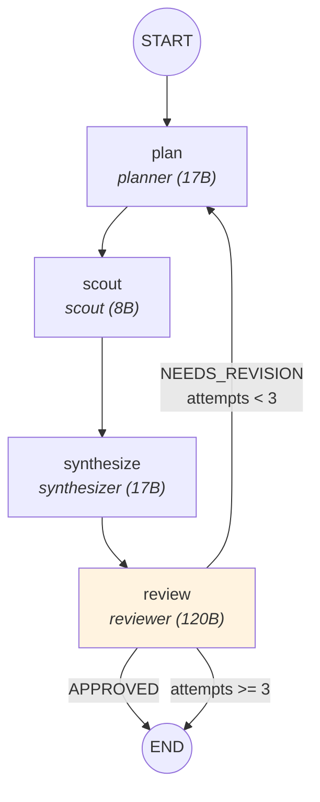

# Module 2 — Directed Graph + Conditional Edges

**Time:** ~8 minutes | **Key idea:** "The graph IS the product spec. 90% of production agents are directed graphs."

## The Graph



Four specialized agents. A quality gate. A retry loop. This is what most production agent systems actually look like.

## What Changed from M1

The monolith planner is split into four roles:

| Agent | Role | Size | Why this size? |
|-------|------|------|----------------|
| **planner** | Rough plan ("idea guy") | 17B | Creative, doesn't need precision |
| **scout** | Venue research | 8B | Fast, high-volume |
| **synthesizer** | Merge plan + research → JSON | 17B | Needs structured output |
| **reviewer** | Approval gate | 120B | Needs judgment |

## State Shape — What's New

```python
# graph/m2/state.py
class M2State(TypedDict):
    request: NightOutRequest
    messages: Annotated[list, add_messages]
    plan: str                  # NEW — rough plan text
    raw_research: str          # NEW — scout's venue research
    itinerary: Itinerary | None
    review_passed: bool        # NEW — did reviewer approve?
    review_feedback: str       # NEW — why it was rejected
    attempts: int              # NEW — retry counter
```

M1 had 3 fields. M2 has 8. The new fields track intermediate work (plan, research) and the review loop (passed, feedback, attempts).

## The Retry Loop

The reviewer outputs either `APPROVED` or `NEEDS_REVISION: <feedback>`. The condition function routes accordingly:

```python
# graph/m2/conditions.py
MAX_ATTEMPTS = 3

def should_retry(state: M2State) -> str:
    if state.get("review_passed", False):
        return "end"
    if state.get("attempts", 0) >= MAX_ATTEMPTS:
        return "end"
    return "retry"
```

And in the workflow:

```python
# graph/m2/workflow.py
builder.add_conditional_edges(
    "review",
    should_retry,
    {"end": END, "retry": "plan"}
)
```

When the reviewer rejects, the planner gets the feedback injected into its next prompt:

```python
# graph/m2/nodes.py — inside _plan_msg()
if feedback:
    user_msg += f"\nPrevious attempt was rejected. Feedback: {feedback}\n"
    user_msg += "Adjust your plan accordingly.\n"
```

This is **dynamic prompting** — the prompt changes based on state.

## The Workflow Builder

```python
# graph/m2/workflow.py
def _wire(builder):
    builder.add_edge(START, "plan")
    builder.add_edge("plan", "scout")
    builder.add_edge("scout", "synthesize")
    builder.add_edge("synthesize", "review")
    builder.add_conditional_edges("review", should_retry, {"end": END, "retry": "plan"})
```

Read this like a spec: plan → research → synthesize → review → approve or retry. Every edge is explicit. Product logic (retry up to 3 times) lives in code, not hidden in a prompt.

## Key Diff from M1

```diff
  # State: 3 fields → 8 fields
+ plan: str
+ raw_research: str
+ review_passed: bool
+ review_feedback: str
+ attempts: int

  # Graph: 1 node → 4 nodes + conditional edge
- START → plan_night → END
+ START → plan → scout → synthesize → review → (conditional) → END or plan

  # Agents: 1 prompt → 4 prompts
- agents/planner_v1.md
+ agents/planner.md, scout.md, synthesizer.md, reviewer.md
```

## Pydantic Resilience

The `Itinerary` model in `schemas/nightout.py` handles messy LLM output:

```python
# schemas/nightout.py
class Stop(BaseModel):
    model_config = {"coerce_numbers_to_str": True}

    degen_score: int = Field(default=5, ge=0, le=10)

    @field_validator("degen_score", mode="before")
    @classmethod
    def coerce_degen_score(cls, v):
        if isinstance(v, float):
            return int(round(v))
        return v
```

LLMs return `6.5` instead of `7`, or `"$20"` where you expect a string. Pydantic validators handle this at the boundary so downstream code never sees it.

## Teaching Script

> "M1 was one call. Now we have four agents in a directed graph. Look at the graph — you can read it like a product spec. Plan, research, assemble, review. If the review fails, loop back with feedback. This is how 90% of production agents work. Not some magical autonomous loop — a deliberate graph where every edge is a product decision."
>
> "Notice the reviewer gets a bigger model (120B). The planner just needs creativity, but the reviewer needs judgment. You pick model sizes based on the cognitive demand of the task."
>
> "Open Langfuse — you'll see four generation spans. Compare this to M1's single span. Same cost, way more debuggable."
