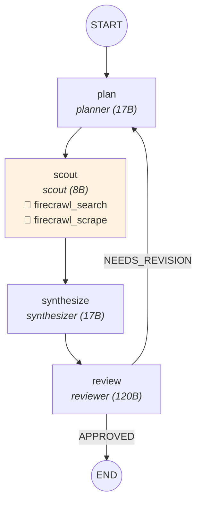
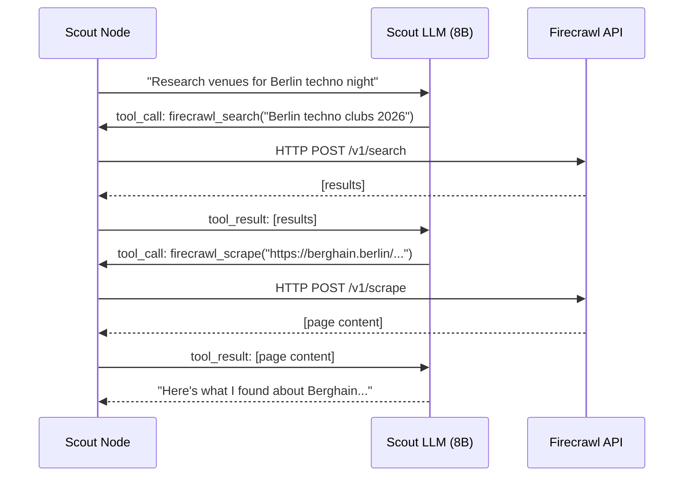

# Module 3 — Tools + RBAC


## The Graph



Same graph as M2. The only change: the scout now has real tools.

## What Changed from M2

The graph structure is identical. The state is identical. What's new is **infrastructure**:

1. A tool abstraction (`tools/base.py`)
2. Firecrawl implementations (`tools/firecrawl.py`)
3. RBAC configuration (`config/tools.yaml`)
4. A tool-calling loop (`graph/common.py`)

## Tool Architecture

### 1. Base Tool

```python
# tools/base.py
class BaseTool(ABC):
    name: str
    description: str

    async def run(self, **kwargs) -> ToolResult:
        ...

    def to_langchain_tool(self) -> dict:
        # Returns OpenAI function-calling spec
        ...
```

Every tool has a `name`, `description`, `run()` method, and a way to export itself as an OpenAI function spec. The LLM sees the spec; the runtime calls `run()`.

### 2. Firecrawl Tools

```python
# tools/firecrawl.py
class FirecrawlSearch(BaseTool):
    name = "firecrawl_search"
    description = "Search the web for current information"
    # → hits api.firecrawl.dev/v1/search via httpx

class FirecrawlScrape(BaseTool):
    name = "firecrawl_scrape"
    description = "Extract content from a specific URL"
    # → hits api.firecrawl.dev/v1/scrape via httpx
```

Both are async, using `httpx` (never `requests` — it blocks the event loop).

### 3. RBAC via YAML

```yaml
# config/tools.yaml
agents:
  planner: []
  scout:
    - firecrawl_search
    - firecrawl_scrape
  synthesizer: []
  reviewer: []
```

Only the scout gets tools. The planner, synthesizer, and reviewer get nothing. This is enforced at runtime:

```python
# tools/registry.py
def get_tools_for_agent(agent_name: str) -> list[BaseTool]:
    cfg = _load_tools_config()
    tool_names = cfg.get("agents", {}).get(agent_name, [])
    return [_ALL_TOOLS[name]() for name in tool_names if name in _ALL_TOOLS]
```

Remove `firecrawl_search` from the YAML → the scout can't search anymore. No code changes needed.

## The Tool-Calling Loop

This is the core pattern for tool use. The LLM calls tools, we execute them, feed results back, repeat:

```python
# graph/common.py — call_agent_with_tools()
for round_num in range(MAX_TOOL_ROUNDS):     # up to 5 rounds
    response = await llm_with_tools.ainvoke(messages)
    messages.append(response)

    if not response.tool_calls:               # LLM is done calling tools
        break

    tool_messages = await _execute_tool_calls(
        response.tool_calls, tools
    )
    messages.extend(tool_messages)
```



Each tool execution is wrapped in a Langfuse `span_context`, so you see every tool call in the trace.

## Key Diff from M2

```diff
  # Nodes — only scout changed
  def scout(state):
-     return {"raw_research": call_agent_sync("scout", msg)}
+     return {"raw_research": call_agent_sync_with_tools("scout", msg)}

  # New files
+ tools/base.py          — BaseTool ABC
+ tools/firecrawl.py     — FirecrawlSearch, FirecrawlScrape
+ tools/registry.py      — YAML-driven tool loading
+ config/tools.yaml      — Agent → tool permissions
```

The graph, state, conditions — all unchanged. The only node-level change is `call_agent_sync` → `call_agent_sync_with_tools`.

## Observability

Open Langfuse for an M3 run. You'll see:
- `agent.planner` — generation span
- `agent.scout.round_0` — first LLM call (decides to use tools)
- `tool.firecrawl_search` — span with search query + results
- `tool.firecrawl_scrape` — span with URL + extracted content
- `agent.scout.round_1` — second LLM call (uses tool results to write response)
- `agent.synthesizer` — generation span
- `agent.reviewer` — generation span

Compare to M2: the scout was a single generation span. Now it's a multi-round conversation with tool calls nested inside.

## Teaching Script

> "Same graph as M2. Same state. The only change: the scout can now search the web. But look at how it's wired — tools are declared in YAML, not hardcoded. The scout gets search and scrape. The planner gets nothing. Remove a line from the YAML, the tool is gone. No code change."
>
> "This is RBAC for agents. In production, you don't want every agent calling every API. The manager shouldn't be able to scrape websites. The reviewer shouldn't be able to search. Config-driven permissions."
>
> "Look at the Langfuse trace — see the tool spans nested inside the scout? Each search, each scrape, fully visible. If a tool fails or returns garbage, you see it immediately."
