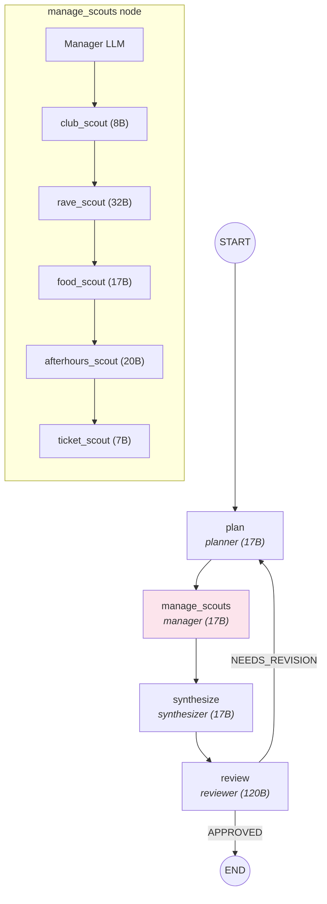

# Module 4 — Subagents


## The Graph



The single scout from M2/M3 is replaced by a **manager** that delegates to **5 specialized scouts**.

## What Changed from M3

| M3 | M4 |
|----|-----|
| 1 generic scout | 5 specialized scouts + 1 manager |
| Scout does all research | Each scout has a domain |
| Scout node calls 1 agent | manage_scouts node calls 6 agents |
| Flat trace | Parent-child trace hierarchy |

## State Shape — What's New

```python
# graph/m4/state.py
class M4State(TypedDict):
    # ... same as M3, plus:
    scout_assignments: list[dict]  # NEW — manager's delegation plan
```

The manager outputs a JSON list of assignments. Each assignment has a `scout` name and a `task` description.

## The Manager Pattern

The manager is an LLM that outputs structured JSON — it doesn't do research itself:

```python
# graph/m4/nodes.py
async def amanage_scouts(state: M4State) -> dict:
    result = await call_agent("manager", _manager_msg(state))
    assignments = _parse_assignments(result)
    research = await _dispatch_scouts_sequential_async(assignments)
    return {"scout_assignments": assignments, "raw_research": research}
```

The manager's prompt (`agents/manager.md`) tells it to assign work:

```markdown
Output a JSON array of assignments:
{"assignments": [
  {"scout": "club_scout", "task": "Research clubs for Berlin techno night..."},
  {"scout": "food_scout", "task": "Find late-night döner near Berghain..."}
]}
```

Available scouts: `club_scout`, `rave_scout`, `food_scout`, `afterhours_scout`, `ticket_scout`.

## Specialized Scouts

Each scout has its own prompt and model, tuned for its domain:

| Scout | Model | Specialization |
|-------|-------|----------------|
| `club_scout` | 8B | Clubs, DJ lineups, door policies |
| `rave_scout` | 32B | Warehouse raves, underground events |
| `food_scout` | 17B | Late-night food, recovery meals |
| `afterhours_scout` | 20B | Afterhours venues, sunrise spots |
| `ticket_scout` | 7B | Ticket links, pre-sale, guest lists |

Models are distributed across different sizes to stay within Groq's free-tier rate limits (each model has its own token quota).

## Sequential Dispatch

In M4, scouts run one after another:

```python
# graph/m4/nodes.py
async def _dispatch_scouts_sequential_async(assignments, use_tools=False):
    reports = []
    for a in assignments:
        scout_name = a["scout"]
        task = a["task"]
        with span_context(name=f"subagent.{scout_name}", input=task) as span:
            result = await call_fn(scout_name, task)
            span.update(output=result)
        reports.append(f"## {scout_name}\n{result}")
    return "\n\n".join(reports)
```

Each scout call is wrapped in a `span_context` — this creates a **child span** in Langfuse under the parent trace.

## Key Diff from M3

```diff
  # Graph edges
  START → plan →
- scout
+ manage_scouts
  → synthesize → review → conditional

  # State
+ scout_assignments: list[dict]

  # Agents
- 1 scout (agents/scout.md)
+ 1 manager (agents/manager.md)
+ 5 scouts (agents/club_scout.md, rave_scout.md, food_scout.md,
+            afterhours_scout.md, ticket_scout.md)

  # Config — models.yaml
+ manager, club_scout, rave_scout, food_scout, afterhours_scout, ticket_scout
  # Config — tools.yaml
+ club_scout, rave_scout, food_scout, afterhours_scout, ticket_scout (all get firecrawl)
```

## Observability — Parent-Child Traces

Open Langfuse for an M4 run. The trace hierarchy looks like:

```
nightout-m4 (session trace)
├── agent.planner (generation)
├── agent.manager (generation)
├── subagent.club_scout (span)
│   └── agent.club_scout (generation)
├── subagent.rave_scout (span)
│   └── agent.rave_scout (generation)
├── subagent.food_scout (span)
│   └── agent.food_scout (generation)
├── subagent.afterhours_scout (span)
│   └── agent.afterhours_scout (generation)
├── subagent.ticket_scout (span)
│   └── agent.ticket_scout (generation)
├── agent.synthesizer (generation)
└── agent.reviewer (generation)
```

You can see exactly which scout was called, what it was asked, and what it returned.

## What's Slow

With 5 scouts running sequentially, the manage_scouts node takes ~10 seconds (5 scouts x ~2 seconds each). The scouts don't depend on each other — they could run in parallel. That's Module 5.

## Try It

```bash
uv run python run.py --module 4 "berlin" "techno, underground" "this saturday" 4
```

Check Langfuse — look for the parent-child hierarchy under `manage_scouts`.

## Teaching Script

> "In M3, one scout did everything. Now we have a manager that delegates to specialized scouts. The manager outputs JSON — 'send club_scout to research Berghain, send food_scout to find döner.' Each scout has its own prompt tuned for its domain."
>
> "Look at the Langfuse trace. See the hierarchy? The manager is a parent, each scout is a child span. You can click into any scout and see exactly what it researched. This is production-grade observability."
>
> "But notice the timing — these scouts run one after another. 10 seconds for 5 scouts. They don't depend on each other. Why not run them all at once? That's M5."
