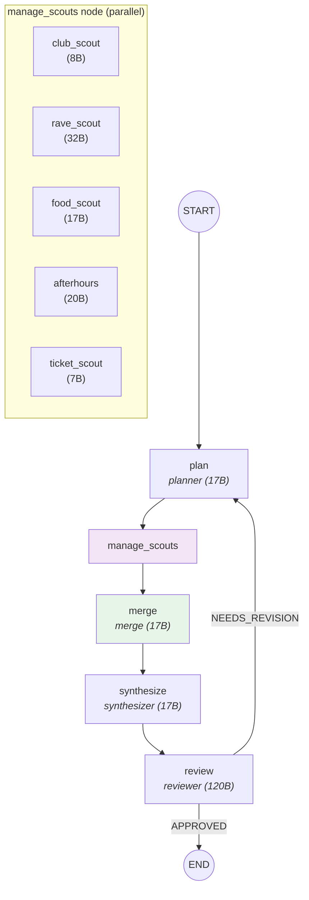
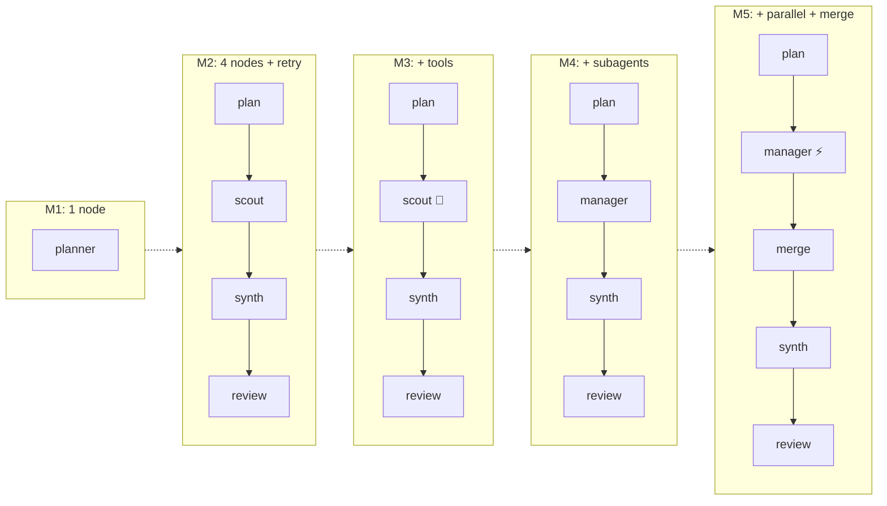

# Module 5 — Parallel Fan-Out + Merge


## The Graph



Two changes from M4: scouts run **in parallel**, and a new **merge** node deduplicates their reports.

## What Changed from M4

| M4 | M5 |
|----|-----|
| Scouts run sequentially (~10s) | Scouts run in parallel (~2s) |
| No merge step | Merge agent deduplicates reports |
| raw_research → synthesizer | raw_research → merge → merged_research → synthesizer |

## State Shape — What's New

```python
# graph/m5/state.py
class M5State(TypedDict):
    # ... same as M4, plus:
    merged_research: str   # NEW — deduplicated research from merge agent
```

## Parallel Dispatch

The key change is `asyncio.gather` — all scouts fire at once:

```python
# graph/m5/nodes.py
async def _dispatch_scouts_parallel(assignments, use_tools=False):
    start = time.monotonic()
    tasks = [
        _dispatch_scout(a["scout"], a["task"], use_tools)
        for a in assignments
    ]
    reports = await asyncio.gather(*tasks)
    elapsed = time.monotonic() - start
    log.info("parallel_scouts_complete",
             count=len(assignments), elapsed_s=round(elapsed, 2))
    return "\n\n".join(reports)
```

Compare to M4's sequential loop:

```python
# M4: sequential — each scout waits for the previous one
for a in assignments:
    result = await call_fn(a["scout"], a["task"])
    reports.append(result)

# M5: parallel — all scouts run at once
tasks = [_dispatch_scout(a["scout"], a["task"], use_tools) for a in assignments]
reports = await asyncio.gather(*tasks)
```

Same work. 5x faster wall-clock time.

## The Merge Agent

When scouts run in parallel, they don't see each other's work. Two scouts might research the same venue, or give conflicting info. The merge agent fixes this:

```python
# graph/m5/nodes.py
async def amerge(state: M5State) -> dict:
    return {"merged_research": await call_agent("merge", _merge_msg(state))}
```

The merge prompt (`agents/merge.md`) instructs:
- Combine all scout reports into one unified document
- Deduplicate — if two scouts found the same venue, merge their info
- Flag conflicts — if scouts disagree on hours or prices, note both
- Organize by venue, not by scout

## Key Diff from M4

```diff
  # Graph edges
  START → plan → manage_scouts →
+ merge →
  synthesize → review → conditional

  # Dispatch
- research = await _dispatch_scouts_sequential_async(assignments)
+ research = await _dispatch_scouts_parallel(assignments)

  # New node
+ async def amerge(state):
+     return {"merged_research": await call_agent("merge", _merge_msg(state))}

  # Synthesizer reads merged data
  def _synthesize_msg(state):
-     f"VENUE RESEARCH:\n{state['raw_research']}"
+     f"VENUE RESEARCH:\n{state['merged_research']}"

  # State
+ merged_research: str

  # New agent
+ agents/merge.md
```

## Sync vs Async — VizLang vs CLI

The codebase maintains two variants:

```python
# graph/m5/nodes.py

# Sync (VizLang) — scouts sequential, for visualization
def manage_scouts(state):
    research = _dispatch_scouts_sequential(assignments)  # one-by-one
    ...

# Async (CLI/API) — scouts parallel, for production
async def amanage_scouts(state):
    research = await _dispatch_scouts_parallel(assignments)  # all at once
    ...
```

VizLang runs the sync graph (sequential scouts) because it's easier to visualize step-by-step. The CLI and API run the async graph (parallel scouts) for speed.

## Observability — Parallel Traces

In Langfuse, M5's trace shows parallel scout spans:

```
nightout-m5 (session trace)
├── agent.planner (generation)
├── agent.manager (generation)
├── subagent.club_scout (span)      ─┐
├── subagent.rave_scout (span)       │ all start at ~same time
├── subagent.food_scout (span)       │
├── subagent.afterhours_scout (span) │
├── subagent.ticket_scout (span)    ─┘
├── agent.merge (generation)
├── agent.synthesizer (generation)
└── agent.reviewer (generation)
```

Look at the timestamps — the 5 scout spans overlap. In M4, they were stacked end-to-end.

## The Full Picture



## Teaching Script

> "One change turns 10 seconds into 2: `asyncio.gather`. The scouts don't depend on each other, so we fire them all at once. Same work, same results, fraction of the time."
>
> "But now we have a new problem — scouts don't see each other's work. Two might research the same club. One says it closes at 2am, another says 4am. That's where the merge agent comes in. It deduplicates, resolves conflicts, and organizes everything by venue."
>
> "Look at the Langfuse trace. See how the scout spans all start at the same timestamp? In M4 they were stacked. That's the speedup, and you can see it directly in the observability."
>
> "This is the full production pattern: plan → delegate → parallel research → merge → synthesize → review → retry. Five modules, and you've built something that looks like a real agent system."
