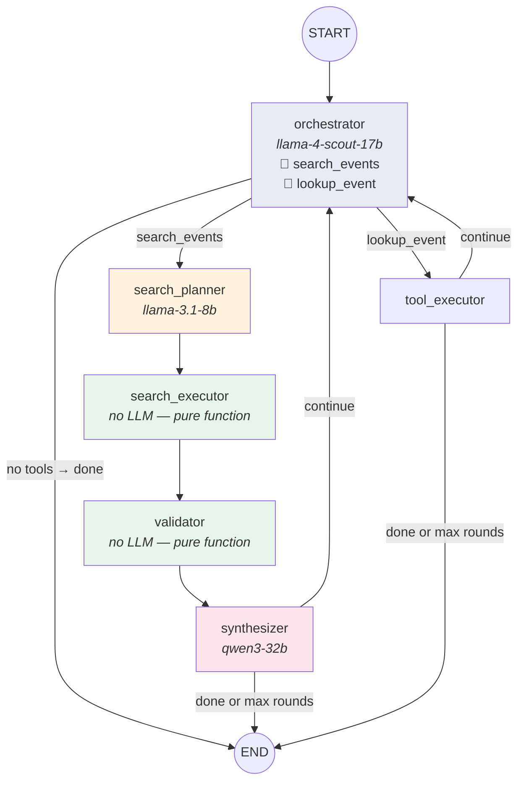

# Module 6 — Multi-Agent Search Orchestra


## The Graph



Five nodes in a pipeline, triggered by an orchestrator. The orchestrator decides IF to search; the pipeline handles HOW.

## The Evolution: Single Agent → Pipeline

This is the teaching point of M6.

| | Naive ReAct (what we started with) | Search Orchestra (what we built) |
|---|---|---|
| **Architecture** | 1 agent loops with 4 tools | orchestrator → planner → executor → validator → synthesizer |
| **Who searches?** | The LLM (often hallucinates instead) | Deterministic pipeline — no LLM in the search loop |
| **Query quality** | Single broad query | 5-8 targeted queries decomposed by planner LLM |
| **Validation** | None — trusts search results | Scrapes top results to verify they're real |
| **Hallucination** | Frequent — model narrates tool use | Eliminated by design — LLM only decides IF to search |
| **Rate limits** | 1 model, burns through TPM | 3 models on 3 separate TPM pools |
| **Max LLM calls** | 10 rounds of ReAct | 3 orchestrator rounds × 1 planner + 1 synthesizer |

## What's New in M6

### 1. Multi-Agent Pipeline (Not a ReAct Loop)

```python
# graph/m6/workflow.py
def _wire(builder):
    builder.add_edge(START, "orchestrator")
    builder.add_conditional_edges("orchestrator", route_action, {
        "search_pipeline": "search_planner",
        "direct_lookup": "tool_executor",
        "respond": END,
    })
    builder.add_edge("search_planner", "search_executor")
    builder.add_edge("search_executor", "validator")
    builder.add_edge("validator", "synthesizer")
```

When the orchestrator calls `search_events`, it triggers a 4-node pipeline instead of executing the tool directly. This is the "virtual tools" pattern — the LLM sees callable tools, but the graph intercepts them for routing.

### 2. Model Distribution (TPM Management)

```yaml
# config/models.yaml — 3 models = 3 separate 6K TPM budgets
deep_orchestrator:    meta-llama/llama-4-scout-17b-16e-instruct  # Pool A
search_planner:       llama-3.1-8b-instant                       # Pool B
search_synthesizer:   qwen/qwen3-32b                             # Pool C
```

Each model has its own rate-limit pool on Groq's free tier. No single model exceeds ~3K tokens per turn. This is the key trick for staying under free-tier limits with a multi-agent system.

### 3. Search Planner (Query Decomposition)

```python
# graph/m6/nodes.py — search_planner
# Input: "mainstream melodic EDM bay area"
# Output:
[
    {"query": "Illenium San Francisco 2026 concert", "strategy": "artist", "tool": "event_search"},
    {"query": "ODESZA Bay Area 2026 tour dates", "strategy": "artist", "tool": "event_search"},
    {"query": "Insomniac events Bay Area 2026", "strategy": "promoter", "tool": "firecrawl_search"},
    {"query": "Bill Graham Civic EDM shows 2026", "strategy": "venue", "tool": "event_search"},
]
```

A small, fast LLM (8B) decomposes one vague query into 5-8 targeted searches using domain knowledge baked into its prompt (artist rosters, venue mappings, promoter names).

### 4. Parallel Execution + Validation

```python
# search_executor: parallel searches with rate limiting
batch_results = await asyncio.gather(
    *[_run_search(item) for item in plan],
    return_exceptions=True
)

# validator: parallel scraping to verify events are real
results = await asyncio.gather(
    *[_validate_one(e) for e in to_validate],
    return_exceptions=True
)
```

Both the executor and validator run in parallel with `asyncio.gather` and a `Semaphore(3)` to limit concurrent Firecrawl calls.

### 5. Anti-Hallucination by Design

The orchestrator LLM never sees raw search results. It only decides:
- "Should I search?" → calls `search_events`
- "Should I look up a URL?" → calls `lookup_event`
- "Do I have enough info?" → responds to the user

The pipeline produces results deterministically. The synthesizer (a different LLM) formats them. Neither can hallucinate events that don't exist in the search results.

### 6. Think-Tag Stripping

```python
# qwen3-32b leaks chain-of-thought in <think> tags
_THINK_RE = re.compile(r"<think>.*?</think>\s*", re.DOTALL)
content = _THINK_RE.sub("", response.content).strip()
```

Some models (like qwen3-32b) emit internal reasoning in `<think>` tags. We strip these before adding the response to messages.

## State

```python
class M6State(TypedDict):
    messages: Annotated[list, add_messages]  # Chat history
    tool_rounds: int                         # Orchestrator loop counter
    done: bool                               # Termination flag
    current_query: str                       # Extracted intent for pipeline
    search_plan: list[dict]                  # Planner output
    raw_results: list[dict]                  # Executor output
    validated_results: list[dict]            # Validator output
```

Compare to M5's 10+ fields. M6 has 7 — 3 for chat control, 4 for pipeline data that gets cleared after each search cycle.

## Tools

### Virtual Tools (Orchestrator sees these)

```yaml
# config/tools.yaml
deep_orchestrator:
  - search_events    # triggers pipeline, not direct execution
  - lookup_event     # direct scrape via tool_executor
```

### Real Tools (Pipeline uses these internally)

- **EventSearch** — parallel search across RA, Dice, Eventbrite
- **FirecrawlSearch** — web search via Firecrawl API
- **TicketLookup** — scrapes a specific event URL for details

## Observability

```
nightout-m6-chat (session trace)
├── agent.orchestrator.round_0 (generation) — decides to search
├── agent.search_planner (generation) — decomposes into 6 queries
├── search.artist (span) — "Illenium SF 2026"
├── search.venue (span) — "Bill Graham EDM"
├── search.promoter (span) — "Insomniac Bay Area"
├── validate (span) × 8 — scrapes top results
├── agent.search_synthesizer (generation) — ranks and formats
```

Each pipeline stage is a separate span. Compare to the naive ReAct agent where all 10 rounds look identical.

## Key Diff from Naive ReAct

```diff
  # Architecture: 1 looping agent → 5-node pipeline
- agent → agent → agent → ...
+ orchestrator → planner → executor → validator → synthesizer

  # Hallucination: possible → eliminated by design
- LLM sees tools, often narrates instead of calling
+ LLM only decides IF to search, pipeline produces results

  # Search quality: 1 broad query → 5-8 targeted queries
- "find EDM events in SF"
+ "Illenium SF 2026" + "ODESZA Bay Area" + "Insomniac events" + ...

  # Rate limits: 1 model, burns 6K TPM → 3 models, 3 pools
- deep_agent: llama-4-scout (all 6K TPM)
+ orchestrator: scout + planner: 8b + synthesizer: qwen3-32b

  # Validation: none → parallel scraping
- trusts search results blindly
+ scrapes top 8, filters dead/fake/outdated
```

## Try It

**CLI:**
```bash
# Interactive chat
uv run python run.py --module 6

# One-liner
uv run python run.py --module 6 "find me melodic EDM shows in the bay area"
```

**API:**
```bash
# Create a chat session
curl -s -X POST http://localhost:8200/chat | jq
# → {"session_id": "abc123", "created_at": "...", "messages": []}

# Send a message (replace abc123 with your session_id)
curl -s -X POST http://localhost:8200/chat/abc123/messages \
  -H "Content-Type: application/json" \
  -d '{"message": "find me raves in SF this weekend"}' | jq .assistant_message.content

# Follow up — agent remembers context
curl -s -X POST http://localhost:8200/chat/abc123/messages \
  -H "Content-Type: application/json" \
  -d '{"message": "what about afterhours?"}' | jq .assistant_message.content

# View full history
curl -s http://localhost:8200/chat/abc123 | jq .messages
```

**Requires:** `GROQ_API_KEY` and `FIRECRAWL_API_KEY` in your `.env` file.

## Teaching Script

> "Remember the naive deep agent? It hallucinated fake events instead of searching. The problem isn't the model — it's the architecture. A single ReAct agent has to decide what to search, execute the search, validate results, AND format the response. That's too many jobs for one context window."
>
> "The Search Orchestra splits these into a pipeline. The orchestrator just decides IF to search. A separate planner decomposes the query. The executor runs searches in parallel. The validator scrapes results to prove they're real. The synthesizer formats everything. No single agent can hallucinate because no single agent has enough power to."
>
> "Look at the model distribution — three different models on three separate rate-limit pools. On Groq's free tier, each model gets 6K tokens per minute. One model can't handle a full search cycle, but three models together can."
>
> "**The lesson: when a single agent hallucinates, don't just fix the prompt. Redesign the architecture so hallucination is structurally impossible.**"
