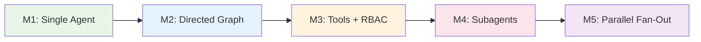

# Workshop Overview — Building Production AI Agents


## What We're Building

A **Night Out Agent** — give it a city, vibe, date, and group size, and it plans your entire night: pregame, main event, recovery meal, and everything in between.

We'll build it five times, each time adding a production pattern that real agent systems use. By the end, you'll have a multi-agent system with tool use, parallel execution, and full observability.

## The Five Modules



| Module | Pattern | Key Concept |
|--------|---------|-------------|
| **M1** | Single LLM call | "One call is an agent. Observability makes it debuggable." |
| **M2** | Directed graph + retry | "The graph IS the product spec. 90% of production agents." |
| **M3** | Tool use + RBAC | "Without RBAC, every agent can do everything." |
| **M4** | Manager + subagents | "The manager doesn't work — it delegates." |
| **M5** | Parallel fan-out + merge | "Fan-out is easy. Merge is the product." |

## Tech Stack

| Layer | Tool | Why |
|-------|------|-----|
| Orchestration | **LangGraph** | State machines for agent workflows |
| LLM | **Groq** (free tier) | Fast inference, multiple models |
| Observability | **Langfuse** (self-hosted) | Traces, spans, session grouping |
| Tools | **Firecrawl** | Web search + scrape for real venue data |
| Schemas | **Pydantic v2** | Type-safe boundaries between agents |
| API | **FastAPI** | Async HTTP wrapper around the graph |

## Project Layout

```
agents-workshop/
  agents/          # LLM system prompts (one .md per agent)
  graph/
    common.py      # Shared: call_agent(), tool loop, helpers
    registry.py    # Module dispatcher
    m1/ ... m5/    # Each module: state, nodes, conditions, workflow
  tools/           # Firecrawl wrappers (search, scrape)
  config/
    models.yaml    # Agent -> model mapping
    tools.yaml     # Agent -> tool permissions (RBAC)
  schemas/         # Pydantic models (NightOutRequest, Itinerary)
  observability.py # Langfuse tracing
  api/             # FastAPI server
  run.py           # CLI runner
```

## Key Architecture Idea

Every module follows the same pattern:

1. **State** — a `TypedDict` that grows as modules add features
2. **Nodes** — Python functions that call LLMs and return state updates
3. **Edges** — connections between nodes (linear or conditional)
4. **Workflow** — a `StateGraph` compiled into a runnable

LangGraph compiles these into a graph that can be invoked synchronously (for visualization in VizLang) or asynchronously (for the API/CLI).

## How to Follow Along

Each module lesson includes:
- A mermaid diagram of the graph
- The state shape (what data flows through)
- Key code snippets with file paths
- What changed from the previous module (the diff)
- A teaching script you can use verbatim

Start with M1 and work forward. Each module builds on the last.
